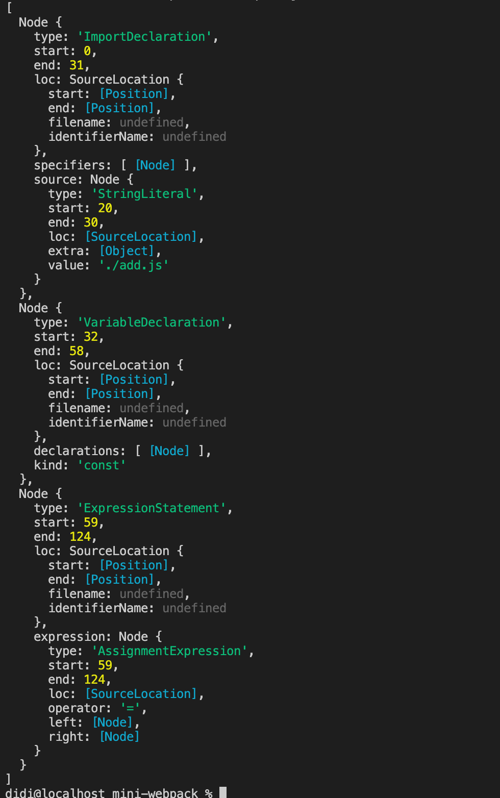
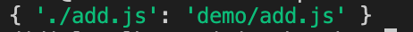
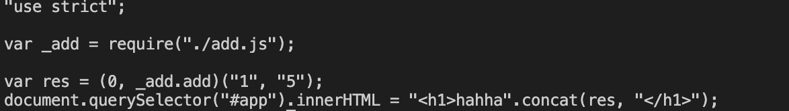
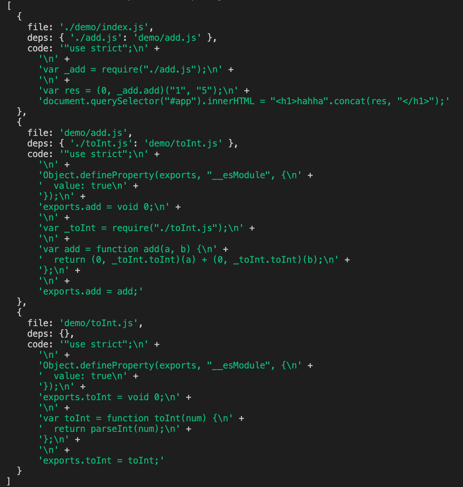
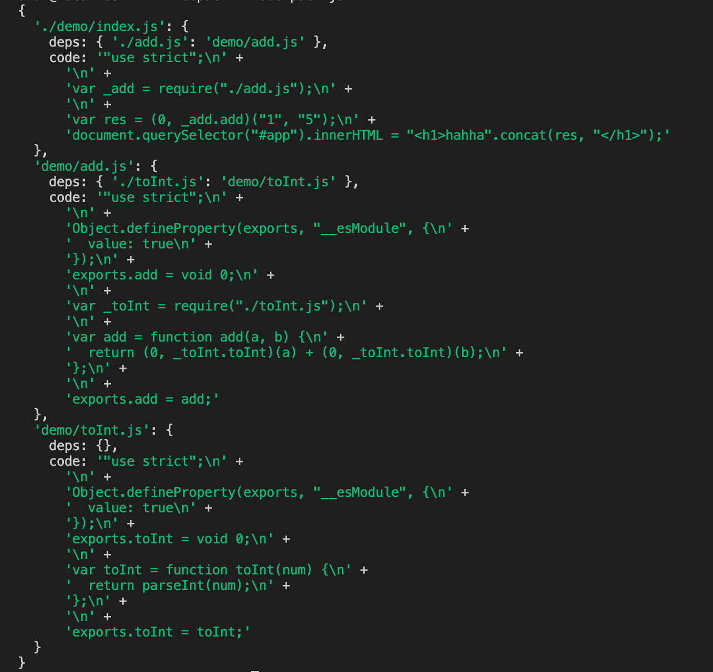
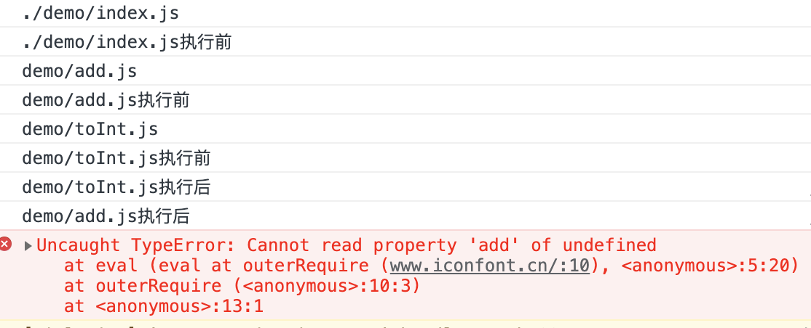
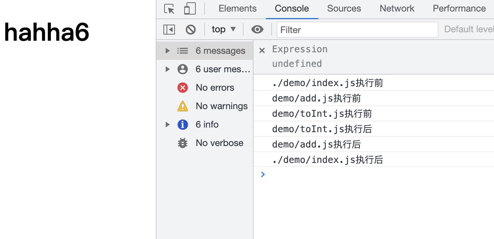

# 超级简单的webpack实现，理解webpack核心原理

在demo文件夹下，有一个index.js，一个add.js，一个toInt.js，内容分别如下
add.js
```javascript
import { toInt } from "./toInt.js";
export const add = (a, b) => toInt(a) + toInt(b);
```
toInt.js
```javascript
export const toInt = num => parseInt(num);
```
index.js
```javascript
import { add } from "./add.js";
const res = add("1", "5");
document.querySelector("#app").innerHTML = `<h1>hahha${res}</h1>`
```

我们的⽬标是将上面两个互相依赖的js打包为⼀个可以在浏览器中运⾏的⼀个JS⽂件(bundle.js)

整体的流程如下

1. 读取入口文件，进行模块分析
2. 分析递归获取到所有的依赖，将所有收集到的依赖编译成浏览器可以运行的代码
3. 整合代码，生成浏览器可以运行的代码文件

### 1、模块分析
模块的分析相当于对读取的⽂件代码字符串进⾏解析，这⼀步其实和⾼级语⾔的编译过程⼀致。我们借助babel/parser来完成，将模块解析为抽象语法树AST。
安装包

```bash
npm i @babel/parser @babel/traverse @babel/core @babel/preset-env 
```
读取js，收集入口的js所有依赖的模块，编译与AST解析

```javascript
const fs = require("fs");
const path = require("path");
const parser = require("@babel/parser");
const traverse = require("@babel/traverse").default;
const babel = require("@babel/core");

module.exports = function (file) {
    const dirname = path.dirname(file);
    // 读取js
    const body = fs.readFileSync(file, "utf-8");
    // 解析ast语法树
    const ast = parser.parse(body, {
        sourceType: "module", // 表示要解析esmodule
    });
    console.log(ast.program.body); 
}
```
打印出来的ast.program.body如下，包含代码的信息，如type是ImportDeclaration的是，import声明，source是他依赖的模块的信息


### 2、分析和收集依赖

我们使用traverse来遍历我们解析出来的树，第二个参数的ImportDeclaration表示所有type是ImportDeclaration的节点都会进入这个函数，通过traverse的遍历，我们能拿到入口文件所有依赖的模块

```javascript
const deps = {};
traverse(ast, {
    ImportDeclaration({ node }) {
        // 所有的import节点都会进入这里
        // 拿到绝对路径
        const abspath = path.join(dirname, node.source.value);
        deps[node.source.value] = abspath;
    }
});
```

得到的deps如下：



接着使用babel转换代码，其中presets是预设，可以理解成你写的代码是什么代码，使用什么方式来处理，我们写的代码是ES2015+的代码，则使用@babel/preset-env来编译 ES2015+ 语法，官方的还有@babel/preset-typescript用于TypeScript，@babel/preset-react用于React，不做过多赘述

```javascript
const { code } = babel.transformFromAst(ast, null, {
    presets: ["@babel/preset-env"]
});
```
拿到的code代码如下


到此，我们拿到了入口文件的依赖```deps```和经过babel转换后的代码```code```

最终的parseModule如下

```javascript
const fs = require("fs");
const path = require("path");
const parser = require("@babel/parser");
const traverse = require("@babel/traverse").default;
const babel = require("@babel/core");

module.exports = function (file) {
    const dirname = path.dirname(file);
    const body = fs.readFileSync(file, "utf-8");
    // 解析ast语法树
    const ast = parser.parse(body, {
        sourceType: "module", // 表示要解析esmodule
    });

    // 使用traverse遍历ast语法树，收集当前文件所有的依赖（import）
    const deps = {};
    traverse(ast, {
        ImportDeclaration({ node }) {
            // 所有的import节点都会进入这里
            // 拿到绝对路径
            const abspath = path.join(dirname, node.source.value);
            deps[node.source.value] = abspath;
        }
    });
    
    const { code } = babel.transformFromAst(ast, null, {
        presets: ["@babel/preset-env"]
    }); // 转换出来的code，import变成了require

    return {
        file,
        deps,
        code,
    }
}
```


根据上面的code和deps，我们看到，转换后的code，import变成了require，入口文件的依赖deps，key就是require的值，value就是文件的路径，我们可以根据deps，进一步收集到demo/index.js的依赖和code

```javascript
const getModuleInfo = require("./getModuleInfo.js");
module.exports = function (file) {
    const info = getModuleInfo(file);
    const temp = [info];
    getDeps(temp, info.deps);
    console.log(temp);
}

function getDeps(temp, deps) {
    Object.keys(deps).forEach(key => {
        const depInfo = getModuleInfo(deps[key]);
        temp.push(depInfo);
        getDeps(temp, depInfo.deps);
    })
}
```


拿到的temp如下




我们对数据做一个转换，变成文件路径为key的对象

```javascript
const depsGraph = {};
for (const moduleInfo of temp) {
  depsGraph[moduleInfo.file] = {
    deps: moduleInfo.deps,
    code: moduleInfo.code,
  };
}
console.log(depsGraph);
```




到此，我们就拿到了所有文件对应的浏览器可运行的代码，但是我们看到，上面的代码打包的代码包含了require和exports，浏览器环境下，是没有这些变量的，我们是否可以自定义这些变量呢？答案是可以的

### 3. 整合代码，生成浏览器可运行的文件

#### 3.1 实现require函数

对于上面拿到的depsGraph，我们最终是要把其变成浏览器可运行的文件代码

1. 我们先定义一个require函数，接收一个file参数，一开始执行require入口文件

   ```html
   <!DOCTYPE html>
   <html>
   
   <head>
       <title>测试</title>
   </head>
   
   <body>
       <div id="app"></div>
       <script>
            var depsGraph = {
             './demo/index.js': {
               deps: { './add.js': 'demo/add.js' },
               code: '"use strict";\n' +
                 '\n' +
                 'var _add = require("./add.js");\n' +
                 '\n' +
                 'var res = (0, _add.add)("1", "5");\n' +
                 'document.querySelector("#app").innerHTML = "<h1>hahha".concat(res, "</h1>");'
             },
             'demo/add.js': {
               deps: { './toInt.js': 'demo/toInt.js' },
               code: '"use strict";\n' +
                 '\n' +
                 'Object.defineProperty(exports, "__esModule", {\n' +
                 '  value: true\n' +
                 '});\n' +
                 'exports.add = void 0;\n' +
                 '\n' +
                 'var _toInt = require("./toInt.js");\n' +
                 '\n' +
                 'var add = function add(a, b) {\n' +
                 '  return (0, _toInt.toInt)(a) + (0, _toInt.toInt)(b);\n' +
                 '};\n' +
                 '\n' +
                 'exports.add = add;'
             },
             'demo/toInt.js': {
               deps: {},
               code: '"use strict";\n' +
                 '\n' +
                 'Object.defineProperty(exports, "__esModule", {\n' +
                 '  value: true\n' +
                 '});\n' +
                 'exports.toInt = void 0;\n' +
                 '\n' +
                 'var toInt = function toInt(num) {\n' +
                 '  return parseInt(num);\n' +
                 '};\n' +
                 '\n' +
                 'exports.toInt = toInt;'
             }
           };
   
           function require(file) {
             console.log(file);
             console.log(depsGraph[file])
             eval(depsGraph[file].code);
           }
           require("./demo/index.js");Ï
       </script>
   </body>
   
   </html>
   ```

直接浏览器打开上面的html，发现到入口文件的代码可以执行，但是执行require('./add.js')的时候报错了，原因是depsGraph没有./add.j这个key，我们还需对require函数做一些修改，做一步路径转换

```javascript
function outerRequire(entry) {
  function require(file) {
    var relKey = curData.deps[file];
    outerRequire(relKey);
  }
  var curData = depsGraph[entry];
  eval(depsGraph[entry].code);
}
outerRequire("./demo/index.js");
```

这回require可以正常执行了，但是执行add.js的code的时候，报Uncaught ReferenceError: exports is not defined，这时候我们再定义一个exports变量

```javascript
function outerRequire(entry) {
  console.log(entry);
  var curData = depsGraph[entry];
  function require(file) {
    var relKey = curData.deps[file];
    return outerRequire(relKey);
  }
  var exports = {};
  console.log(`${entry}执行前`);
  eval(depsGraph[entry].code);
  console.log(`${entry}执行后`);
  return exports;
}
outerRequire("./demo/index.js");
```

执行结果如下




应该是因为exports对象没有返回

```javascript
function outerRequire(entry) {
  var curData = depsGraph[entry];
  function require(file) {
    var relKey = curData.deps[file];
    return outerRequire(relKey);
  }
  var exports = {};
  console.log(`${entry}执行前`);
  eval(depsGraph[entry].code);
  console.log(`${entry}执行后`);
  return exports;
}
outerRequire("./demo/index.js");
```

做了修改后，浏览器执行正常



所以我们的require函数就开发完成了，接下来我们就是生成文件

#### 3.2 生成文件

我们整理一下代码，将代码拼接后生成js文件，现在我们固定写死文件保存到dist目录下的bundle.js文件

index.js文件实现如下

```javascript
const parseModules = require("./parseModules.js");
const fs = require("fs");
const path = require("path");
module.exports = function (file) {
    const res = bundle(file);
    const dirExist = fs.existsSync("./dist");
    if (!dirExist) {
        fs.mkdirSync("./dist");
    }
    fs.writeFileSync("./dist/bundle.js", res, {
        encoding: "utf-8"
    })
}

function bundle(file) {
    const depsGraph = parseModules(file);
    return `
    var depsGraph = ${JSON.stringify(depsGraph)};
    function outerRequire(entry) {
        var curData = depsGraph[entry];
        function require(file) {
          var relKey = curData.deps[file];
          return outerRequire(relKey);
        }
        var exports = {};
        eval(depsGraph[entry].code);
        return exports;
    }
    outerRequire("${file}");
    `;
}
```

然后我们写pack.js

```javascript
const miniPack = require("./src/index.js");
miniPack("./demo/index.js");
```

运行pack.js

```bash
node pack.js
```

可以正常再dist目录下生成了bundle.js

浏览器打开html也和预期一致

```html
<!DOCTYPE html>
<html>

<head>
    <title>测试</title>
</head>

<body>
    <div id="app"></div>
    <script src="../dist/bundle.js"></script>
</body>

</html>
```

至此，webpack的核心实现已经完成了


### 思考

webpack支持import不同的文件类型，不同的文件类型有对应的loader来处理，其本质也是把import的模块变成可运行的js文件，如样式文件，是一段创建style标签的js，具体模块该如何处理要看具体的loader代码，但是最终是变成一段可以运行的js代码

